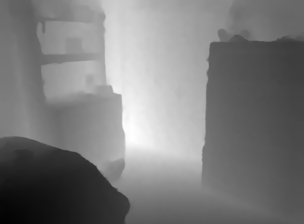
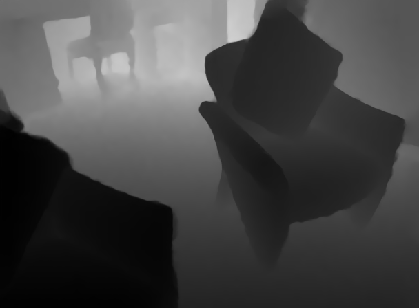
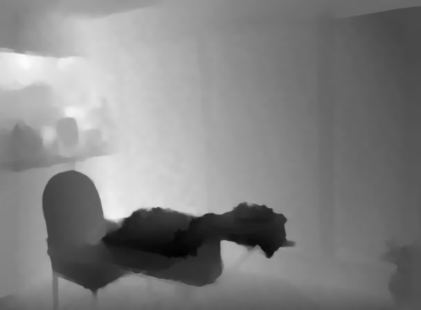

# [Spatially Variant Linear Representation Models for Joint Filtering](http://openaccess.thecvf.com/content_CVPR_2019/papers/Pan_Spatially_Variant_Linear_Representation_Models_for_Joint_Filtering_CVPR_2019_paper.pdf)

## Dependencies

- Python = 3.8
- PyTorch = 1.5
- TensorBoard
- numpy
- os
- cv2
- PIL
- glob
- logging

## Training
I trained and tested the model on a single NVIDIA RTX 2080Ti GPU, and this process took about 9 hours for 50w iterations. The training strategies are the same as paper except for the learning rate updating method. We update lr in the following manner:
```bash
lr_ = opt.lr * (0.5 ** (epoch // opt.decay_step))
for param_group in optim.param_groups:
    param_group['lr'] = lr_
```
The author uses poly policy:
```bash
lr_ = opt.lr * (1 - float(curr_step) / opt.n_iters)**2
for param_group in optim.param_groups:
    param_group['lr'] = lr_
```

- Command

```bash
#x4
python train.py --upscaling_factor 4
#x8
python train.py --upscaling_factor 8
#x16
python train.py --upscaling_factor 16
```

## Testing

```bash
#x4
python test.py --upscaling_factor 4 --model weights/X4/model_10000_epoch.pth
#x8
python test.py --upscaling_factor 8 --model weights/X8/model_10000_epoch.pth
#x16
python test.py --upscaling_factor 16 --model weights/X16/model_10000_epoch.pth
```

## Results

- Quantitative results (RMSE)

| depth image SR | SVLRM (paper) | Ours | 
| :----- | :-----: | :-----: | 
| x4 | 1.74 | 1.66738 |
| x8 | 5.59 | 3.20587 | 
| x16 | 7.23 | 5.82709 | 

Our all models results can download [Baidu Cloud](https://pan.baidu.com/s/16R5kPtLyv-pOVzOcb5_aKQ)  code: h39w or [Google Drive](https://drive.google.com/drive/folders/1FGMNWsgj6gSlrWeXqfYNfSR9nC7sUMVT)

Our all models results can download [Baidu Cloud] (https://pan.baidu.com/s/17Myh_xhocOFs7sgzqNvhUA) code: drkb or [Google Drive]  (https://drive.google.com/drive/folders/17ADNrYqn7Fj0IhuefBxSKcaKyHrfJan0?usp=sharing)

- Visual results (X8 depth sr)

on the left is output of the model, on the right is the corresponding ground truth image
 

img_001065 || RMSE:2.7260 || PSNR:39.4204 || SSIM:0.9820

 

img_001101 || RMSE:3.9308 || PSNR:36.2413 || SSIM:0.9749

 

img_001215  || RMSE:2.7663 || PSNR:39.2927 || SSIM:0.9838

 

img_001320 || RMSE:3.8851 || PSNR:36.3428 || SSIM:0.9762

 

img_001436 || RMSE:3.4263 || PSNR:37.4344 || SSIM:0.9871
## Acknowledgements
- [SVLRM_matlab](https://www.dropbox.com/s/1z9ps20welw3c9a/CVPR19_SV_code.zip?dl=0)
- [SVLRM_Pytorch](https://github.com/curlyqian/SVLRM)
