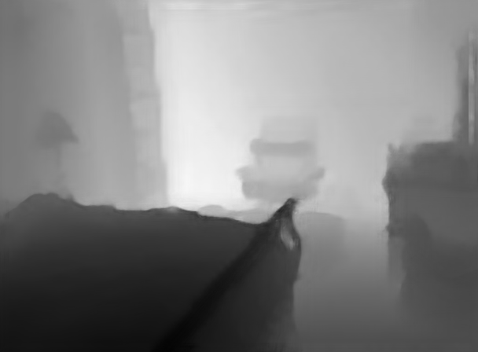
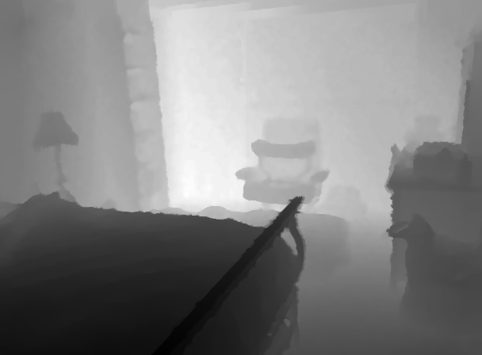
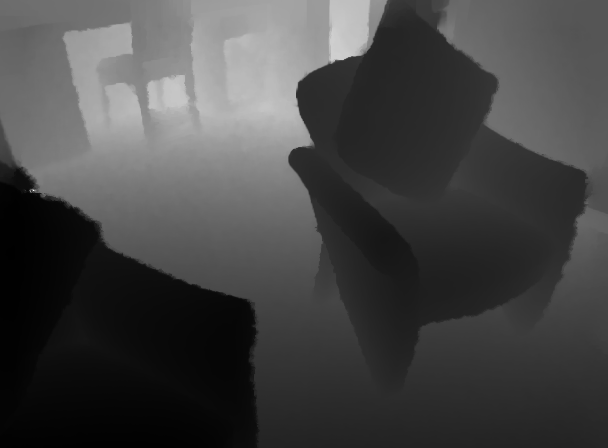
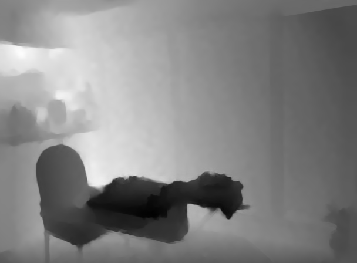
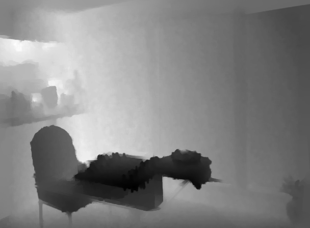
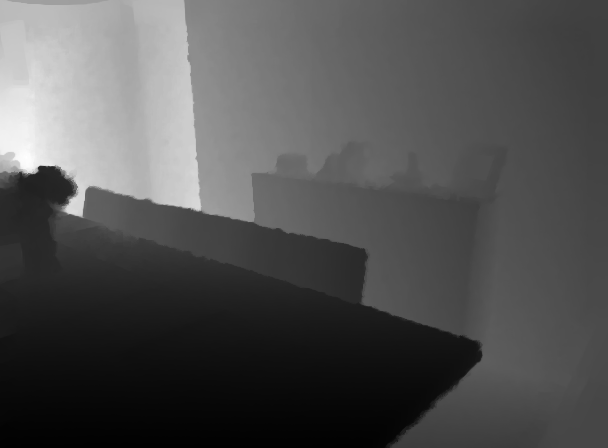

# [Spatially Variant Linear Representation Models for Joint Filtering](http://openaccess.thecvf.com/content_CVPR_2019/papers/Pan_Spatially_Variant_Linear_Representation_Models_for_Joint_Filtering_CVPR_2019_paper.pdf)

## Dependencies

- Python = 3.8
- PyTorch = 1.5
- TensorBoard
- numpy
- os
- cv2
- PIL
- glob
- logging

## Training
I trained and tested the model on a single NVIDIA RTX 2080Ti GPU. The training strategies are same as the paper.

- Command

```bash
#x4
python train.py --upscaling_factor 4
#x8
python train.py --upscaling_factor 8
#x16
python train.py --upscaling_factor 16
```

## Testing

```bash
#x4
python test.py --upscaling_factor 4 --model weights/X4/model_192600_iter.pth
#x8
python test.py --upscaling_factor 8 --model weights/X8/model_177200_iter.pth
#x16
python test.py --upscaling_factor 16 --model weights/X16/model_192600_iter.pth
```

## Results

- Quantitative results (RMSE)

| Depth Image SR | SVLRM (paper) | Ours |
| :----- | :-----: | :-----: | 
| x4 | 1.74 | 1.6722 |
| x8 | 5.59 | 3.2172|
| x16 | 7.23 | 5.8599 |


Our all models results can download from [Baidu Cloud](https://pan.baidu.com/s/1UDMUZ_qHpf8-n3RUtyDpOw)  code: 788x or [Google Drive](https://drive.google.com/file/d/14lOXxvtq9BPwSAiXuVM_CeV5VYLJHHUv/view?usp=sharing)


- Visual results (X8 depth sr)

on the left is output of the model, on the right is the corresponding ground truth image
 

img_001065 || RMSE:2.5730 || PSNR:39.9219 || SSIM:0.9825

 

img_001101 || RMSE:3.8905 || PSNR:36.3307 || SSIM:0.9748

 

img_001215  || RMSE:2.7525 || PSNR:39.3362 || SSIM:0.9839

 

img_001320 || RMSE:3.8696 || PSNR:36.3774 || SSIM:0.9751

 

img_001436 || RMSE:3.2991 || PSNR:37.7628 || SSIM:0.9763
## Acknowledgements
- [SVLRM_matlab](https://www.dropbox.com/s/1z9ps20welw3c9a/CVPR19_SV_code.zip?dl=0)
- [SVLRM_Pytorch](https://github.com/curlyqian/SVLRM)
